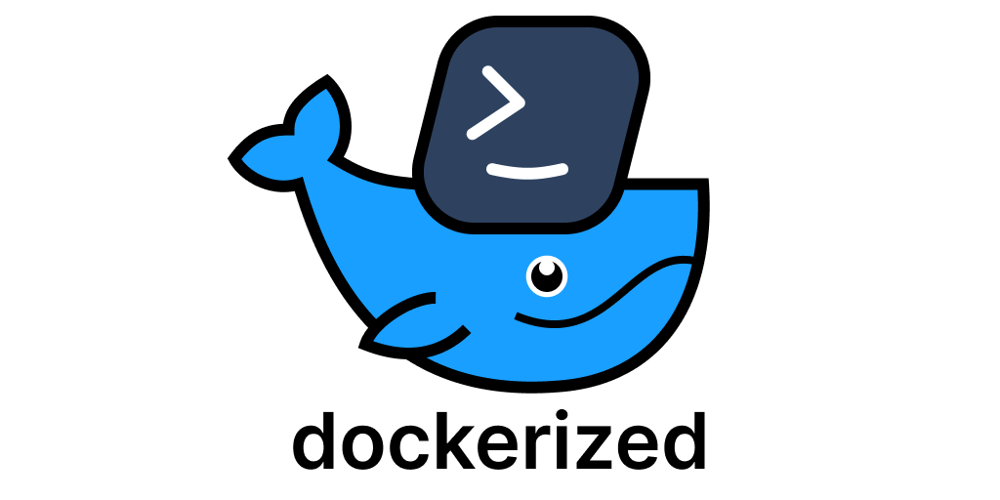
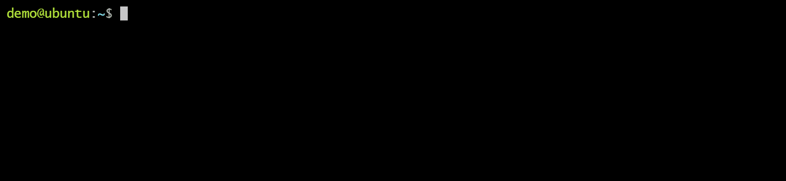

# Dockerized [](https://github.com/datastack-net/dockerized/actions/workflows/test.yml) 

Run popular commandline tools without installing them.

```shell
dockerized <command>
```



## Supported commands

> If your favorite command is not included, it can be added very easily. See [Customization](#customization).  
> Dockerized will also fall back to over 150 commands defined in [jessfraz/dockerfiles](https://github.com/jessfraz/dockerfiles).

- Cloud
  - [aws](apps/aws/README.md)
  - [az](apps/az/README.md) (Azure CLI)
  - [doctl](apps/doctl/README.md)
  - [s3cmd](apps/s3cmd/README.md)
- Dev-Ops & Docker
  - ansible
    - ansible-playbook
  - helm
- Git
  - git 
  - [gh](apps/gh/README.md) (Github)
- Languages & SDKs
  - [dotnet](apps/dotnet/README.md)
  - go
    - gofmt 
  - (haskell)
    - ghci
  - java
  - perl
  - php
    - composer 
  - lua
  - node
    - [npm](apps/npm/README.md)
    - npx
    - vue
    - yarn
  - python
    - pip
    - python
    - python2
  - ruby
    - gem
    - rake
  - (rust)
    - rustc
  - (prolog)
    - swipl (SWI-Prolog)
  - typescript
    - tsc
- Networking:
  - http
  - telnet
  - wget
- Unix
  - tree
  - zip
- Other utilities
  - youtube-dl (Youtube downloader)
  - jq
  - (latex)
    - pdflatex
  - protoc
  - swagger-codegen

## Installation

- Make sure [Docker](https://docs.docker.com/get-docker/) is installed on your machine.
- Download the latest zip from our [Release Page](https://github.com/datastack-net/dockerized/releases).
  - Extract it to a folder, for example your home directory.
- Add the `dockerized/bin` directory to your `PATH`  
   <details>
   <summary>Instructions</summary>
  
     **Linux / MacOS:**

     ```bash
     export PATH="$PATH:$HOME/dockerized/bin"
     ```
     **Windows**

     > See: [How to add a folder to `PATH` environment variable in Windows 10](https://stackoverflow.com/questions/44272416)
  
   </details>

### Running from source

You can run dockerized directly from source-code.

<details>
<summary>Installation from Source
</summary>

- Requirements:
  - [Git](https://git-scm.com/downloads)
  - [Docker](https://docs.docker.com/get-docker/)
- Steps
  - Clone the repository
    ```shell
    git clone https://github.com/datastack-net/dockerized.git
    ```
  - Run `dockerized`:  
    ```shell
    bin/dockerized --help
    ```

    - The first time you run dockerized, it will compile itself.
      - Compilation is done within docker, no dependencies needed.
    - To re-compile after changing the source code, run:
      - `dockerized --compile` (runs within docker)
      - `dockerized --compile=host` (runs on your machine, requires Go 1.17+)
    - You do not need to re-compile to add commands. See [Add a command](DEV.md).

</details>


## Usage

Run any supported command, but within Docker.

```shell
dockerized <command>
```

Examples:

```bash
dockerized node --version             # v16.13.0
dockerized vue create new-project     # create a project with vue cli
dockerized tsc --init                 # initialize typescript for the current directory
dockerized npm install                # install packages.json
```

## Use Cases

- Quickly try out command line tools without the effort of downloading and installing them.
- Installing multiple versions of node/python/typescript.
- You need unix commands on Windows.
- You don't want to pollute your system with a lot of tools you don't use.
- Easily update your tools.
- Ensure everyone on the team is using the same version of commandline tools.

## Design Goals

- All commands work out of the box.
- Dockerized commands behave the same as their native counterparts.
  - Files in the current directory are accessible using relative paths.
- Cross-platform: Works on Linux, MacOS, and Windows (CMD, Powershell, Git Bash).
- Suitable for ad-hoc usage (i.e. you quickly need to run a command, that is not on your system).
- Configurability: for use within a project or CI/CD pipeline.

## Switching command versions 

### Ad-hoc

Add `:<version>` to the end of the command to override the version.

```shell
dockerized node:15
```


### Listing versions

To see which versions are available, run:

```shell
dockerized node:?
# or
dockerized node:
```

### Environment Variables

Each command has a `<COMMAND>_VERSION` environment variable which you can override.

- `python`: `PYTHON_VERSION`
- `node`: `NODE_VERSION`
- `tsc`: `TSC_VERSION`

Notes:
- Versions of some commands are determined by other commands.  
  For example, to configure the version of `npm`, you should override `NODE_VERSION`.
- See [.env](.env) for a list of configurable versions.


**Global**

- Create a `dockerized.env` file in your home directory for global configuration.   

    ```shell
    # dockerized.env (example)
    NODE_VERSION=16.13.0
    PYTHON_VERSION=3.8.5
    TYPESCRIPT_VERSION=4.6.2
    ```
  
- List of configuration variables, and defaults:
  - [.env](.env)


**Per project (directory)**

You can also specify version and other settings per directory and its subdirectory.
This allows you to "lock" your tools to specific versions for your project.

- Create a `dockerized.env` file in the root of your project directory.
- All commands executed within this directory will use the settings specified in this file.


**Ad-hoc (Unix)**

- Override the environment variable before the command, to specify the version for that command.

    ```shell
    NODE_VERSION=15.0.0 dockerized node
    ```

**Ad-hoc (Windows Command Prompt)**

- Set the environment variable in the current session, before the command.

    ```cmd
    set NODE_VERSION=15.0.0
    dockerized node
    ```

## Customization

Dockerized uses [Docker Compose](https://docs.docker.com/compose/overview/) to run commands, which are defined in a Compose File.
The default commands are listed in [docker-compose.yml](docker-compose.yml). You can add your own commands or customize the defaults, by loading a custom Compose File.

The `COMPOSE_FILE` environment variable defines which files to load. This variable is set by the included [.env](.env) file, and your own `dockerized.env` files, as explained in [Environment Variables](#environment-variables). To load an additional Compose File, add the path to the file to the `COMPOSE_FILE` environment variable.


### Including an additional Compose File

**Globally**

To change global settings, create a file `dockerized.env` in your home directory, which loads an extra Compose File.
In this example, the Compose File is also in the home directory, referenced relative to the `${HOME}` directory. The original variable `${COMPOSE_FILE}` is included to preserve the default commands. Omit it if you want to completely replace the default commands.

```bash
# ~/dockerized.env
COMPOSE_FILE="${COMPOSE_FILE};${HOME}/docker-compose.yml"
```

```yaml
# ~/docker-compose.yml
```

**Per Project**

To change settings within a specific directory, create a file `dockerized.env` in the root of that directory, which loads the extra Compose File. `${DOCKERIZED_PROJECT_ROOT}` refers to the absolute path to the root of the project.
 
```shell
# ./dockerized.env
COMPOSE_FILE="${COMPOSE_FILE};${DOCKERIZED_PROJECT_ROOT}/docker-compose.yml"
```

```yaml
# ./docker-compose.yml
```

### Adding custom commands

After adding your custom Compose File to `COMPOSE_FILE`, you can add your own commands. 

```yaml
# docker-compose.yml
version: "3"
services:
  du:
    image: alpine
    entrypoint: ["du"]
```

> Now you can run `dockerized du` to see the size of the current directory.

> To learn how to support versioning, see [Development Guide: Configurable Version](DEV.md#configurable-version).

You can also mount a directory to the container:

```yaml
# docker-compose.yml
version: "3"
services:
  du:
    image: alpine
    entrypoint: ["du"]
    volumes:
      - "${HOME}/.config:/root/.config"
      - "${DOCKERIZED_PROJECT_ROOT}/foobar:/foobar"
```

> Make sure host volumes are **absolute paths**. For paths relative to home and the project root, you can use `${HOME}` and `${DOCKERIZED_PROJECT_ROOT}`.

> It is possible to use **relative paths** in the service definitions, but then your Compose File must be loaded **before** the default: `COMPOSE_FILE=${DOCKERIZED_PROJECT_ROOT}/docker-compose.yml;${COMPOSE_FILE}`. All paths are relative to the first Compose File. Compose Files are also merged in the order they are specified, with the last Compose File overriding earlier ones. Because of this, if you want to override the default Compose File, you must load it before _your_ file, and you can't use relative paths.

> To keep **compatibility** with docker-compose, you can specify a default value for `DOCKERIZED_PROJECT_ROOT`, for example: `${DOCKERIZED_PROJECT_ROOT:-.}` sets the default to `.`, allowing you to run like this as well: `docker-compose --rm du -sh /foobar`.

To customize existing commands, you can override or add properties to the `services` section of the Compose File, for the command you want to customize. For example, this is how to set an extra environment variable for `dockerized aws`:

```yaml
# docker-compose.yml
version: "3"
services:
  aws:
    environment:
      AWS_DEFAULT_REGION: "us-east-1"
```

If you'd like to pass environment variables directly from your `dockerized.env` file, you can expose the variable as follows:

```bash
# dockerized.env
AWS_DEFAULT_REGION="us-east-1"
```

```yaml
# docker-compose.yml
version: "3"
services:
  aws:
    environment:
      AWS_DEFAULT_REGION: "${AWS_DEFAULT_REGION}"
```


For more information on extending Compose Files, see the Docker Compose documentation: [Multiple Compose Files](https://docs.docker.com/compose/extends/#multiple-compose-files). Note that the `extends` keyword is not supported in the Docker Compose version used by Dockerized.

## Localhost

Dockerized applications run within an isolated network. To access services running on your machine, you need to use `host.docker.internal` instead of `localhost`. 

```shell
dockerized telnet host.docker.internal 8080 # instead of telnet localhost 8080
```

## Limitations

- It's not currently possible to access parent directories. (i.e. `dockerized tree ../dir` will not work)
  - Workaround: Execute the command from the parent directory. (i.e. `cd .. && dockerized tree dir`)
- Commands will not persist changes outside the working directory, unless specifically supported by `dockerized`.
